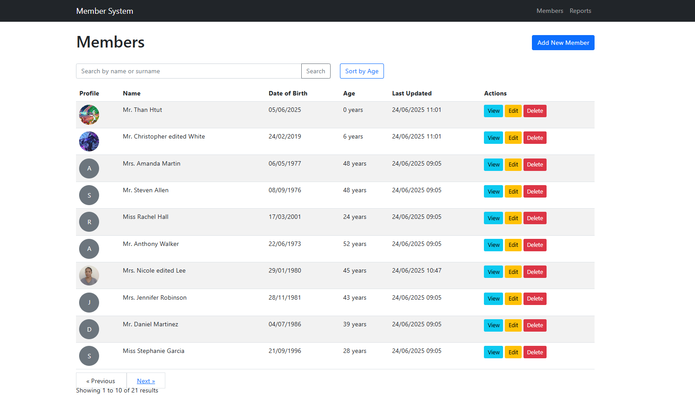
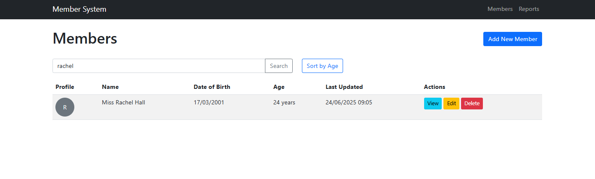
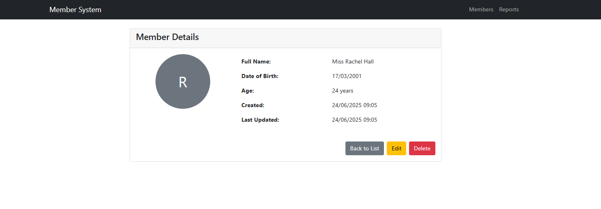
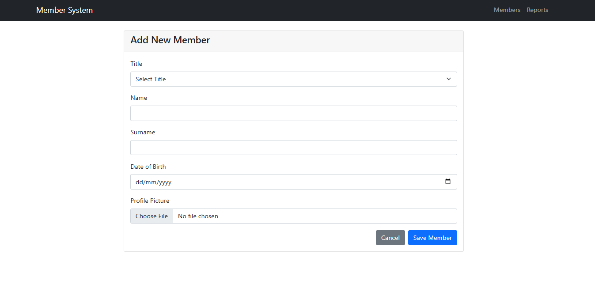
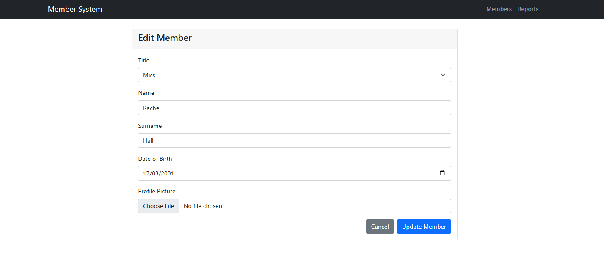

# 📘 Laravel Member Management System

A Laravel-based web application for managing members with admin panel features and dashboard reports.

---

## 📝 Description

This system allows the **admin** to:
- View, add, edit, and delete members
- View dashboard reports:
  - Members by age group (chart + summary)
  - All members listed in detail
  - Search members by name or surname

---

## ⚙️ Requirements

- PHP >= 8.1  
- Composer  
- MySQL  
- Node.js & npm *(if using frontend assets like Vite)*

---

## 🚀 Installation Guide

### 1. 📂 Clone the Repository

```bash
git clone https://github.com/your-username/your-project.git
cd your-project
```

### 2. 🛠️ Configure Environment Variables

Copy `.env.example` and edit the new `.env` file:

```bash
cp .env.example .env
```

Update these lines in `.env`:

```ini
DB_CONNECTION=mysql
DB_HOST=127.0.0.1
DB_PORT=3306
DB_DATABASE=your_database_name
DB_USERNAME=your_mysql_username
DB_PASSWORD=your_mysql_password
```

> ⚠️ Ensure that the specified database exists in MySQL.

### 3. 📦 Install Backend Dependencies

```bash
composer install
```

### 4. 🔐 Generate Application Key

```bash
php artisan key:generate
```

### 5. 🧱 Run Migrations

```bash
php artisan migrate
```

### 6. 🌐 Start the Laravel Development Server

```bash
php artisan serve
```

Access the project at:  
[http://127.0.0.1:8000](http://127.0.0.1:8000)

---

## 🎨 (Optional) Frontend Setup

If using frontend assets with Vite:

```bash
npm install
npm run dev
```

---

## 🖼️ Project Screenshots

### 📊 Admin Panel – Homepage  


### 🔍 Search Testing  


### 🧾 Member Details  


### ➕ Add a Member  


### 📝 Edit Member Details  


---

